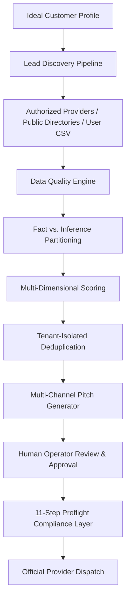

# Rine Forge Systems — Compliant B2B Outbound Lead Engine (`OUTBOUND_ENGINE.md`)

## Executive Summary
The Rine Forge Systems B2B Outbound Lead Engine provides compliant, high-intent discovery, qualification, and personalized messaging for commercial B2B relationships. The engine rejects indiscriminate email scraping, CAPTCHA bypasses, and deceptive bulk spam. Instead, it operates on observable business signals, permitted public directories, authorized APIs, and strict Human-in-the-Loop approval workflows.

---

## 1. System Architecture

The system strictly decouples the client frontend from execution:
1. **Frontend**: Requests ICP creation, triggers discovery runs, previews import CSVs, and reviews generated pitch drafts.
2. **FastAPI Backend**: Enforces tenant scoping (`business_id`), executes validation gates, partitions facts from inferences, and requires operator sign-off.
3. **Database Layer**: Persists `V5Prospect`, `V5ProspectObservation`, `V5ProspectOpportunity`, `V5IdealCustomerProfile`, `V5OutreachApproval`, and `V5SuppressionEntry`.

---

## 2. Ideal Customer Profile (ICP) Specification

Operators define precise target requirements via `V5IdealCustomerProfile` (`/api/v1/lead-engine/icp`):
- **Industry & Verticals**: Primary and secondary industries (e.g. `Dental Clinics`, `Boutique Hotels`, `Commercial HVAC`).
- **Target Company Size & Geography**: Employee count bracket (e.g. `5-50`), metro region (e.g. `Austin, TX`), and operating country (`USA`, `UK`, `Canada`, etc.).
- **Observable Gaps & Services**: Specific service capabilities or technologies targeted (e.g., practices lacking after-hours scheduling or WhatsApp triage).
- **Target Roles**: Decision-maker titles (e.g., `Practice Owner`, `Office Manager`, `Head of Operations`).
- **Exclusions**: Negative criteria (e.g., enterprise hospital networks, out-of-region operators).

When triggered via `POST /api/v1/lead-engine/icp/{id}/run`, the ICP is translated into a targeted search specification across the 13-stage discovery pipeline.

---

## 3. 13-Stage Lead Discovery Pipeline

The discovery engine coordinates 13 rigorous stages to ensure that only legitimate commercial prospects are surfaced:
1. **Source Filtering**: Sourcing only from permitted public directories, website forms, official APIs, and user-provided lists. Prohibits unauthorized platform scraping.
2. **Syntactic Validation**: Checks business name, valid domain, and structured communication handles.
3. **Anti-Health Guard**: Drops queries seeking personal medical conditions or distress signals.
4. **Keyword Relevance Check**: Confirms alignment with target commercial services.
5. **Geo-Targeting Matching**: Matches prospect locations to the targeted metropolitan radius (within 50 miles).
6. **Website Fact Extraction**: Extracts published business hours, contact channels, and booking delays without hallucinations.
7. **AI Opportunity Analyzer**: Detects concrete operational gaps (e.g., 24-48h form delays).
8. **Multi-Dimensional Scoring**: Evaluates intent, geo-fit, engagement depth, and consent factor (0-100 score).
9. **Deduplication & Merging**: Scoped by tenant `business_id`; merges historical observations without resetting outreach statuses.
10. **Suppression & Opt-Out Check**: Verifies candidate against global and tenant suppression lists.
11. **Workflow Review Mode Assignment**: Prospects default to `REVIEW` status, never automatically dispatched.
12. **Evidence-Grounded Draft Generation**: Generates channel-tailored drafts citing observable operational facts.
13. **Audit Trail Logging**: Stores `LeadSearch` and `LeadSearchResult` records for total compliance auditing.

---

## 4. Multi-Channel Pitch Generator

The `PitchGenerator` (`backend/app/outreach/pitch_generator.py`) generates customized, compliant outreach across three channels:

### A. Email Outreach
- **Evidence-Grounded Subject**: Direct, professional subject citing an observable operational gap (e.g., *"Question regarding after-hours patient inquiries at Austin Modern Dental"*).
- **Concise Body**: Directly references the observable evidence (e.g., contact form turnarounds) and introduces Rine Forge AI employees (e.g., Elena AI) as a solution.
- **Clear Call-to-Action**: Proposes a brief, no-pressure 10-minute walkthrough.
- **Mandatory Opt-Out Footer**: Every email includes clear unsubscribe instructions and an explicit opt-out email (`optout@rineforge.com`).

### B. WhatsApp Outreach
- **Mobile-Friendly Conversational Tone**: Short, respectful B2B introduction.
- **Direct Value Statement**: Explains how 24/7 WhatsApp AI triage captures lost appointments.
- **Opt-Out Notice**: Includes mandatory `(Reply STOP to opt out)` text.

### C. SMS Outreach
- **Strict Character Constraint**: Guaranteed under 160 characters to eliminate carrier splitting and message truncation.
- **Concise Value Proposition & Opt-Out**: E.g. *"Hi from Rine Forge AI. Can [Clinic] handle after-hours patient booking? We automate 24/7 triage. Reply YES for info or STOP to opt out."*

### Anti-Deception Guardrails
- **NO Fake Urgency**: Phrases like *"Act now before your competitors take your spot"* are forbidden.
- **NO False Scarcity**: Phrases like *"Only 2 spots remaining"* are prohibited.
- **NO Guaranteed ROI**: Claims such as *"Guaranteed 300% revenue increase"* are strictly disallowed.

---

## 5. Human-in-the-Loop Approval Workflow

Outbound sending is never automated without explicit human sign-off:
1. Discovered prospects enter `pipeline_stage="DISCOVERED"` and `outreach_status="DRAFT"`.
2. Generated pitches create a `V5OutreachApproval` record in `status="PENDING"`.
3. An authorized human operator reviews the draft in the Rine Forge CRM, with the option to **Approve**, **Edit**, or **Reject**.
4. Only upon explicit human approval is the record marked `status="APPROVED"`, unlocking Gate 9 of the 11-step compliance layer.

---

## 6. Internal AI Sales Assistant

The Rine Forge AI Sales Assistant (`backend/app/sales/assistant.py`) provides operators with instant, conversational intelligence grounded strictly in live tenant CRM data:
- **Follow-up Identification**: Identifies high-scoring prospects awaiting contact or review.
- **Reply Tracking**: Summarizes prospect responses and questions.
- **Data Quality Alerts**: Highlights prospects with missing emails, invalid phones, or unverified channels.
- **Truthful Empty States**: If no records match the query, the assistant returns `"No data yet."` rather than fabricating simulated responses.
