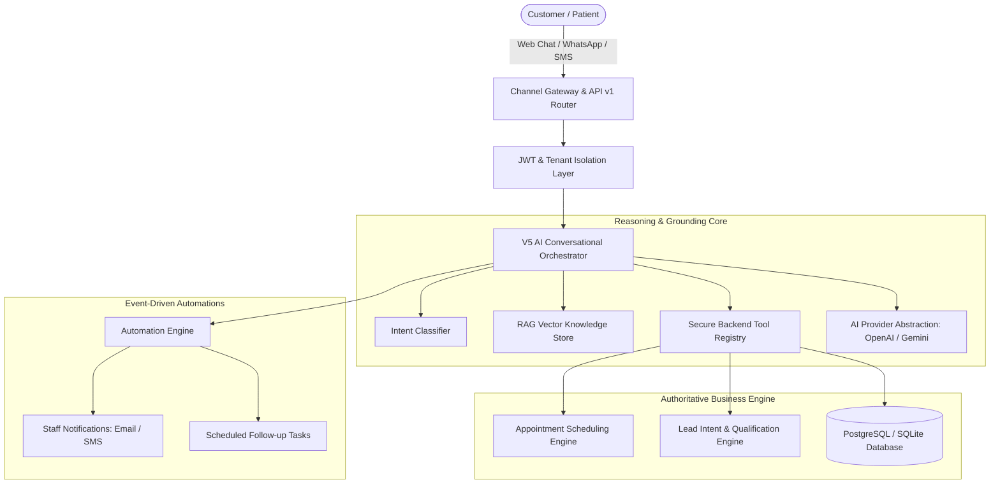

# RINE FORGE SYSTEMS — V5 PRODUCTION PLATFORM ARCHITECTURE

## 1. Executive Summary
Rine Forge Systems V5 is an enterprise-grade, multi-tenant AI Employee platform designed to automate high-friction operational workflows for service businesses (clinics, practices, agencies, law firms, and field services).

Unlike toy chatbots or generic wrapper scripts, Rine Forge Systems V5 operates on an **authoritative backend foundation**:
1. **AI is the reasoning brain, NOT the database.** The AI employee cannot invent prices, operating hours, staff schedules, or appointment bookings.
2. **Strict Multi-Tenancy**: Every entity is scoped to an authenticated `Business` tenant. Cross-tenant access is structurally prevented at the database and dependency injection layers.
3. **Deterministic Backend Execution**: Appointments are checked against business hours and conflict intervals. Bookings atomically lock database records, returning HTTP 409 Conflict if occupied.

---

## 2. High-Level Architecture Diagram



---

## 3. The 20-Step Conversational Pipeline
Every incoming customer turn executes through an authoritative 20-step lifecycle:
1. **Channel Authentication**: Verify inbound webhook or session token.
2. **Tenant Validation**: Load and verify the target `Business` tenant.
3. **Customer Identification**: Find or create the unified `Customer` record across channels.
4. **Session Management**: Locate or instantiate the active `Conversation`.
5. **Human Escalation Check**: If `human_handoff` is active, bypass AI and route to human staff.
6. **AI Employee Persona**: Load the business's active worker (e.g. Elena Receptionist).
7. **Conversational Memory**: Fetch the last 10 dialog turns for context.
8. **RAG Retrieval**: Execute cosine vector similarity search against tenant knowledge chunks.
9. **Intent Classification**: Deterministically categorize intent (e.g. `BOOK_APPOINTMENT`, `PRICE_INQUIRY`).
10. **Tool Selection**: Identify required authoritative tools (`getServices`, `getAvailableAppointments`, etc.).
11. **Tool Execution**: Execute backend operations strictly against database state.
12. **Context Compilation**: Assemble system instructions, database facts, and retrieved policies.
13. **Grounded Generation**: Prompt LLM with zero-hallucination constraints.
14. **Output Verification**: Ensure no fabricated dates, times, or unverified claims.
15. **Turn Persistence**: Atomically save user message and assistant response to `v5_messages`.
16. **Lead Scoring**: Lead engine computes intent score (0–100) and urgency flag.
17. **Automation Dispatch**: Evaluate triggers (`NEW_MESSAGE`, `APPOINTMENT_CREATED`, `HUMAN_HANDOFF`).
18. **Telemetry Recording**: Log latency, model, tokens, and success to `v5_ai_events`.
19. **Usage Accounting**: Increment monthly usage metrics (`v5_usage`).
20. **Formatted Response**: Return channel-specific payload (text, action buttons, metadata).

---

## 4. Directory Structure
```
backend/app/
├── ai/
│   ├── orchestrator_v5.py       # 20-step conversational pipeline
│   ├── provider_abstraction.py  # Unified OpenAI, Gemini, and Local Fallback
│   └── tool_registry.py         # 16 authoritative backend tools
├── api/v1/                      # Master REST API router
│   ├── auth.py                  # Signup, login, profile, logout
│   ├── businesses.py            # Business tenant management & public profiles
│   ├── ai_employees.py          # AI employee persona config & inbound chat
│   ├── services.py              # Service catalog CRUD
│   ├── staff.py                 # Staff practitioner schedules
│   ├── knowledge.py             # RAG document ingestion & vector search
│   ├── customers.py             # Patient & client directory
│   ├── conversations.py         # Transcripts & human handoff
│   ├── appointments.py          # Real-time booking & availability
│   ├── leads.py                 # Lead pipeline & intent scoring
│   ├── automations.py           # Trigger-condition-action rules
│   ├── integrations.py          # Meta WhatsApp, Google Calendar, Stripe
│   ├── analytics.py             # Executive metrics & usage telemetry
│   ├── admin.py                 # Platform superadmin management
│   └── health.py                # System & database health
├── appointments/
│   └── engine.py                # Conflict-free scheduling engine
├── auth/
│   ├── dependencies.py          # Tenant isolation & RBAC checks
│   ├── security.py              # PBKDF2 hashing & JWT creation
│   └── service.py               # Auth operations & tenant provisioning
├── automations/
│   └── engine.py                # Trigger, condition, and action evaluator
├── knowledge/
│   └── rag_service.py           # Text chunking, embedding, cosine search
├── leads/
│   └── engine.py                # Intent & urgency lead scoring
└── models/
    └── v5.py                    # 20 relational models (v5_* tables)
```
